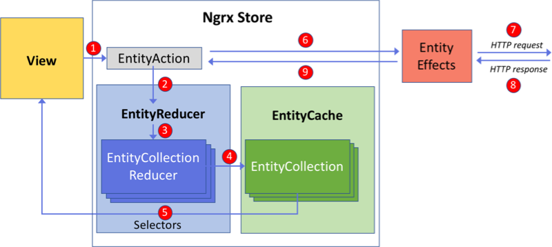

# Introduction to ngrx-data

## Zero Ngrx Boilerplate

***You may never write an action, reducer, selector, effect, or HTTP dataservice again.***

The _ngrx-data_ library makes it easier to write an Angular application that manages [entity](faq.md#entity) data with 
[ngrx](faq.md#ngrx) in a "reactive" style, following the [redux](faq.md#redux) pattern.

>See the [FAQ](faq.md) for definitions and discussion of terms in this overview.
>
>Return to the [overview](README.md) page for a list of documentation topics.

## Why use it?

Many applications have substantial "domain models" with 10s or 100s of entity types. 
Instances of these entity types are created, retrieved, updated, and deleted (CRUD).

If you've tried to manage your entity data with _ngrx_, you've discovered that you have to write a lot of code for each entity type. 
For each type, you've written _actions_, _action-creators_, _reducers_, _effects_, _dispatchers_, and _selectors_ as well as the HTTP GET, PUT, POST, and DELETE methods. 
This is a ton of repetitive code to write, maintain, and test.

This library is _one_ way to stay on the _ngrx_ path while radically reducing the "boilerplate" necessary to manage entities with _ngrx_.

## How it works

You describe your entity model to _ngrx-data_ in a few lines of [entity metadata](entity-metadata.md) and let the library do the rest of the work.

Your component injects an _ngrx-data_ **`EntityService`** and calls one or more of the standard set of command methods for dispatching actions.

Your component also subscribes to one or more of the service's `Observable` _selectors_ in order to reactively process and display entity state changes produced by those commands.

_Ngrx-data_ is really just ngrx under the hood. The data flows in typical ngrx fashion.
The following diagram illustrates the journey of a persistence `EntityAction` 
such as `QUERY_ALL` for the `Hero` entity type.



1. The view/component calls [`EntityService.getAll()`](entity-service.md), which dispatches the hero's `QUERY_ALL` [EntityAction](entity-actions.md) to the store.

2. The _ngrx-data_ [EntityReducer](entity-reducer.md) reads the action's `entityName` property (`Hero` in this example) and
forwards the action and existing entity collection state to the `EntityCollectionReducer` for heroes.

3. The collection reducer picks a switch-case based on the action's `op` (operation) property.
That case processes the action and collection state into a new (updated) hero collection.

4. The store updates the _entity cache_ in the state tree with that updated collection.

5. _Ngrx_ observable selectors detect and report the changes (if any) to subscribers in the view.

6. The original `EntityAction` then goes to the [EntityEffects](entity-effects.md).

7. The effect selects an [EntityDataService](entity-dataservice.md) for that entity type. The data service sends an HTTP request to the server.

8. The effect turns the HTTP response into a new _success_ action with heroes (or an _error_ action if the request failed).

9. _Ngrx effects_ dispatches that action to the store,
which reiterates steps #2 through #5. 

## It's still _ngrx_

This is a _library for ngrx_, not an ngrx alternative.

Every entity has its own actions. Every operation takes its unique journey through the store, reducers, effects, and selectors. You just let _ngrx-data_ create these for you.

You can still add more store properties, actions, reducers, selectors, and effects. You can override any ngrx-data behavior for an individual entity type or for all entities.

You can **see the _ngrx machinery_ at work** with the _redux developer tools_. You can listen to the flow of actions directly. You can **_intercept and override anything_** ... but you only have to intervene where you want to add custom logic. 

### Show me

This repository comes with a demo app for editing _Heroes_ and _Villains_ in the `src/client/app/` folder.

>Instructions to install and run it are in the repository [README](../README.md#install-and-run).

Here's a _slightly reduced_ extract from that demo to illustrate the essential mechanics of configuring and using _ngrx-data_.

You begin with a description of the entity model in a few lines of metadata.

```javascript
/* app/store/entity-metadata.ts */

// Metadata for the entity model
export const entityMetadata: EntityMetadataMap = {
  Hero: {
    sortComparer: sortByName, // optional
    filterFn: nameFilter      // optional
  },
  
  Villain: {
    filterFn: nameAndSayingFilter // optional
  }
};

// Tell ngrx-data how to pluralize entity type names
export const pluralNames = {
  Hero: 'Heroes' // the plural of Hero
};
```

Now register the Web API configuration, metadata, and plurals with the `ngrx-data` module in the root `AppModule`.

```javascript
/* app/app.module.ts */

import { pluralNames, entityMetadata } from './entity-metadata';

// Set 'root', the root URL of the remote Web API.
const defaultDataServiceConfig: DefaultDataServiceConfig = { root: 'api' };

@NgModule({
  imports: [
    NgrxDataModule.forRoot({
      entityMetadata: entityMetadata,
      pluralNames: pluralNames
    })
  ],
  providers: [
    { provide: DefaultDataServiceConfig, useValue: defaultDataServiceConfig }
  ]
})
export class EntityStoreModule {}
```

The `HeroesComponent` creates an `EntityService` for _heroes_
and calls that service to read and save _Hero_ entity data in a reactive, immutable style, _without reference to any of the ngrx artifacts_.

```javascript
/* app/heroes/heroes/heroes.component.ts */

import { EntityService, EntityServiceFactory } from 'ngrx-data';
import { Hero } from '../../core';

@Component({
  selector: 'app-heroes',
  templateUrl: './heroes.component.html',
  changeDetection: ChangeDetectionStrategy.OnPush
})
export class HeroesComponent implements OnInit {
  heroes$: Observable<Hero[]>;
  heroService: EntityService<Hero>;

  constructor(entityServiceFactory: EntityServiceFactory) {
    this.heroService = entityServiceFactory.create<Hero>('Hero');
    this.heroes$ = this.heroService.entities$;
  }

  ngOnInit() {
    this.getHeroes();
  }

  getHeroes() {
    this.heroService.getAll();
  }

  update(hero: Hero) {
    this.heroService.update(hero);
  }

  add(hero: Hero) {
    this.heroService.add(hero);
  }

  deleteHero(hero: Hero) {
    this.heroService.delete(hero.id);
  }
}
```
The component template displays the `heroes$` _observable_
by subscribing to it with the Angular `AsyncPipe`.

```html
<!-- app/heroes/heroes/heroes.component.html -->

<div *ngIf="heroes$ | async as heroes">
  ...
  <app-hero-list 
    [heroes]="heroes"
    (deleted)="deleteHero($event)">
  </app-hero-list>
  ...
</div>
```
